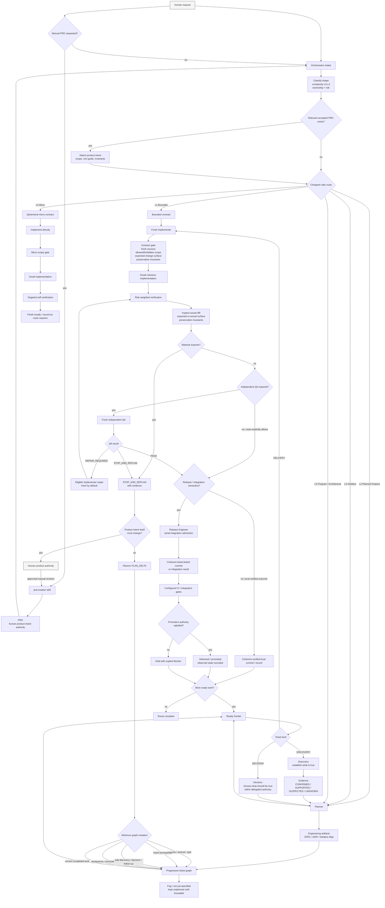
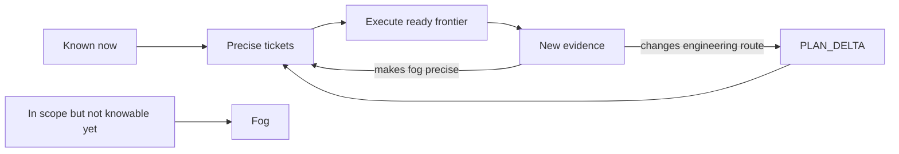
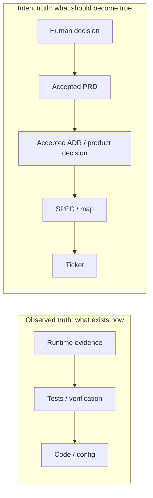

# yaaw-SE End-to-End Workflow

This is the generic control flow. Domain packs may add stack-specific commands, owners, specialist skills, deployment policy, or stricter gates without changing the core authority model.

## What each layer owns

| Layer | Owns | Does not own |
|---|---|---|
| Human / PRD | Product destination, scope, non-goals, product invariants, requirements | Engineering route or automatic backlog |
| Orchestrator | Intake, L0-L4 routing, ownership, freshness, frontier, dispatch | General planning or product implementation |
| Planner | SPEC/ADR/maps, DISCOVERY/DECISION/DELIVERY graph, PLAN_DELTA | Accepted PRD semantics or general coding |
| Discovery | Evidence about what is true | Product decisions |
| Implementer | One bounded delivery contract | Silent scope expansion or graph changes |
| QA | Fresh risk-based review of actual diff and evidence | Same-context repair |
| Release Engineer | Conditional serial integration; coherent ticket-linked commit/integration result; CI/provider/promotion evidence when delivery semantics materially exist | Trivial local ceremony, missing QA, product-code repair, or invented deployment state |

For a simple local verified outcome where `release_engineer_required(...)` is false, the route may finalize a coherent local commit/record without invoking Release Engineer. When multi-branch integration, required CI, non-local environment, promotion, rollback, or provider observation materially exists, Release Engineer owns that serial delivery stage.

## The planning rule

Large work is **not** decomposed into a fake complete backlog on day one.

## The truth rule

Observed state and desired intent are separate:

Missing code can prove that a requirement is not implemented yet. It cannot silently cancel an accepted requirement.

## The commit rule

A commit is one coherent verified outcome: independently understandable, reviewable, and reasonably revertible. Prefer ticket-aligned commits when the boundary is clean. Avoid both one-commit-per-keystroke noise and giant unrelated initiative commits. Commit ownership follows delivery semantics: trivial local outcomes need no Release Engineer ceremony; material integration/release outcomes do.
