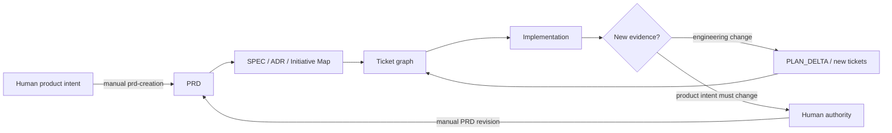

# Product Intent and PRDs

yaaw-SE separates two questions that agentic workflows often collapse:

- **Observed truth:** what is true in the repository/runtime now?
- **Intent truth:** what humans have decided the product should become?

These sources do not override each other because they answer different questions.

## Observed truth

Use current executable evidence in this order:

1. runtime/observable evidence when relevant;
2. executable tests/verification;
3. code and current configuration;
4. accepted architecture facts describing the current system;
5. canonical scoped documentation;
6. thread context and assumptions.

If code lacks a feature required by an accepted PRD, the code proves only that the feature is not implemented yet; it does not cancel the requirement.

## Intent truth

Use explicit product authority in this order:

1. explicit current human decision;
2. accepted relevant PRD;
3. accepted ADR/product decision within its decision scope;
4. active SPEC / initiative map;
5. current tickets;
6. agent inference.

Never upgrade inference into product approval.

## PRD role

A PRD defines the destination: problem, users, outcomes, scope, non-goals, product invariants, requirements, durable constraints, success signals, and unresolved product decisions.

A PRD does **not** freeze the engineering route. The Planner derives the smallest useful engineering structure from it and keeps uncertainty progressive through DISCOVERY, DECISION, DELIVERY, fog, and PLAN_DELTA.

## Invocation policy

`prd-creation` is manual-only. Orchestrator/Planner should discover and read a relevant existing PRD when routing product/initiative work, but absence of a PRD never causes automatic PRD generation.

PRDs normally belong under `docs/prd/<slug>.md`. Their semantic owner is `HUMAN_PRODUCT_AUTHORITY`; repository path ownership exists only to coordinate writes.

## Change policy

Implementation discoveries—bugs, feature suggestions, edge cases, constraints, incompatibilities—go through the existing ticket and PLAN_DELTA machinery. Revise an accepted PRD only when the desired product outcome itself changes and explicit human authority approves that change.
